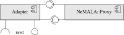
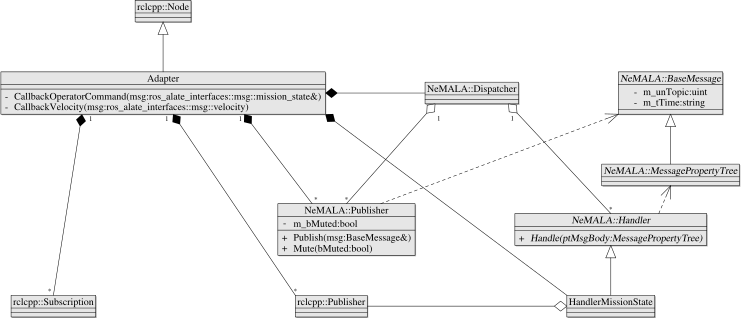

# ros_alate

A ROS2 adapter for the [AntAlate](https://www.frontiersin.org/articles/10.3389/frobt.2021.719496/full) framework



## About

The ros_alate adapter is a ROS2 node that has a [NeMALA::Dispatcher](https://gitlab.com/nemala/core/-/blob/master/doc/components.md) and shares publishers and handlers with it, as shown in the class diagram below.



The adapter adapts the AntAlate messages to ROS2 messages and vice versa.
The adapter's ROS node spins while its NeMALA dispatcher dispatches.
When a subscribed ROS topic invokes one of its callback functions, the adapter publishes the message to the appropriate AntAlate topic.
When the dispatcher dispatches NeMALA messages to its appropriate handlers, they in turn call their ROS2 publishers to publish the ROS version of the incoming message.

In the class diagram above, only the HandlerMissionState is described, but all other concrete handlers are constructed similarly.

## Dependencies

* [NeMALA::Core](https://gitlab.com/nemala/core)
* [ros_alate_interfaces](https://github.com/MARS-Technion/ros_alate_interfaces)

## Subscribes to Topics

1. "alate_input_operator_command"
1. "alate_input_velocity"

## Publishes to Topics

1. "alate_output_mission_control_state"
1. "alate_output_high_level_control_state"
1. "alate_output_high_level_control_telemetry"
1. "alate_output_high_level_control_platform_errors"

## Parameters

| Parameter                     | Meaning		|Default Value	|	Remark	|
| ---------                     | ------------	| -------		|-------	|
| alate_operator_command_topic  | The NeMALA topic ID for the operator command, how the dispatcher knows which handler to call.  | 101 | Should match the NeMALA / Alate configuration. |
| alate_velocity_topic  | The NeMALA topic ID for the velocity command, how the dispatcher knows which handler to call.  | 104 |  Should match the NeMALA / Alate configuration. |
| nemala_node_id  | The NeMALA node ID, how the dispatcher calls itself.  | 402 |  Should match the NeMALA / Alate configuration. |
| proxy_endpoint_for_subscribing  | The NeMALA proxy endpoint for subscriptions. This is the port the dispatcher listens to.  | ipc:///tmp/alate_subscribers |  Should match the NeMALA / Alate configuration. |
| proxy_endpoint_for_publishing  | The NeMALA proxy endpoint for publishing. This is the port the publishers write to.  | ipc:///tmp/alate_publishers |  Should match the NeMALA / Alate configuration. |
| use_sim_time  	           | Should the time also be simulated	| false	|	See [ROS Clock](http://wiki.ros.org/Clock) |

## Usage

Since this package was designed to work alongside an AntAlate application, and not instead of one, The NeMALA proxy and other tools are deliberately out of this package's scope.

### To run:

Given a running [NeMALA::Proxy](https://gitlab.com/nemala/core/-/blob/master/doc/components.md), the next step can be skipped; just make sure to set the right parameters to fit your setup to match the Alate configuration.
In the following command, the working directory contains an Alate configuration file *uav.json* where a proxy named *uav* is described.
For more on Alate configuration files read the [Alate documentation](https://gitlab.com/nemala/alate/-/blob/master/doc/using.md#config).

```console
docker run --rm -v $PWD:/alate/config -v /tmp/nemala:/tmp --name nemala_proxy -it nemala/tools:latest proxy uav /alate/config/uav.json
```

In the following example, we use a parameter file located in the working directory.

```console
ros2 run ros_alate adapter --ros-args --params-file ./adapter.yaml
```

### To terminate:

```console
docker run --rm -v /tmp/nemala:/tmp --name nemala_terminator -it nemala/tools:latest terminate [402] ipc:///tmp/alate_publishers
```

It is better to shut down the dispatcher thread first. Given a running NeMALA proxy, a command similar to the one above should do the trick.
Here we use the arguments matching the ros_alate adapter default parameters; if you use different parameters make sure you use the right arguments in the termination call.

Another way to terminate is to use the keyboard interrupt the good ol' fashioned ROS way, or to send a kill signal, exit the terminal, terminate the container you are running in, smash the computer... all valid choices.
